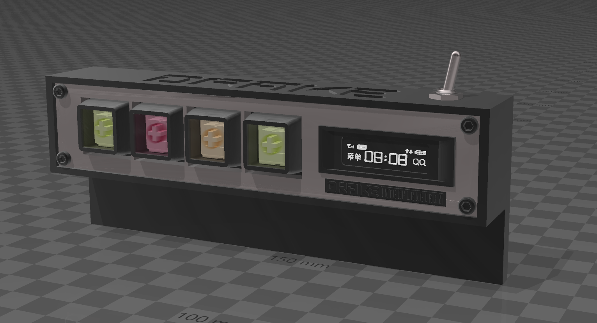

# 4-button
A four button box for attaching to Thrustmaster MFD's
# DRAKE
## Drake 4-button box 1.0



This is the code for the windows HID 4-button box in the style of Star Citizen DRAKE design.

This box is the third design of DRAKE inspired button boxes.
This one is designed to fit atop the Thrustmaster MFD's

You can find the 3D printable files in this repo.

The box uses an Arduino pro micro, and while there is no wiring schematic, the following should be quite straight forward.
All pins are labled as to what they connect to. All buttons and switches are GPIO to ground.

## Arduino Pro Micro wiring diagram
```
                          +-----+
                 +--------| USB |-------+
                 |        +-----+       |
                 | [1] TX         [RAW] |
                 | [0] RX         [GND] |  Ground
         Ground  | [GND]          [RST] |
         Ground  | [GND]          [VCC] |  Voltage for OLED
       OLED SDA  | [2] SDA      A3 [21] |  L.E.D. key 1 (green)
       OLED SCL  | [3] SCL      A2 [20] |  L.E.D. key 2 (green)
    Input Key-1  | [4] A6       A1 [19] |  L.E.D. key 3 (green)
    Input Key-2  | [5]          A0 [18] |  L.E.D. key 4 (green)
    Input Key-3  | [6] A7     SCLK [15] |  L.E.D. key 1 (red)
    Input Key-4  | [7]        MISO [14] |  L.E.D. key 2 (red)
     Cmd Button  | [8] A8     MOSI [16] |  L.E.D. key 3 (red)
                 | [9] A9      A10 [10] |  L.E.D. key 4 (red)
                 |                      |
                 +----------------------+
```

The Box utilizes two color LED's, though you could opt to use just a single color.
The different color just allows for a blink in another color when pressed.

## Keyboard Emulation
The box operates as a Windowd Keyboard. Showing up in Windows as a simple keyboard

There are 5 buttons. Four keyboard keyswitches and one button of your choice.
The four keys will register as a single key press whem pressed. the fifth button switches
profiles.

## Mapping keys to Star Citizen
The key mapping is done by editing the file menumap.h there is a struct for the menu of the buttons

### Default mapping
The default mapping is three profiles. Each button press of button 5 will switch profiles.
1. Profile one. the first four items in keyMenu struct
2. Profile two. the fifth through eighth items in keyMenu struct
3. Profile three. the ninth to end keyMenu struct

Example code from memumap.h This maps the three profiles.
You can see that the struct holds the name to display on the OLED, and the keyboard key to press.

```
const OLEDMENU keyMenu[12] PROGMEM = {
  {"LANDING", "LIGHTS", 'l'},                                      // Menu one key 1
  {"VTOL", "MODE", 'k'},                                           // Menu one key 2
  {"LANDING", "GEAR", 'n'},                                        // Menu one key 3
  {"REQUEST", "LANDING", KEY_INSERT},                              // Menu one key 4
  {"OPEN", "MOBIGLAS", KEY_F1},                                    // Menu two key 1
  {"OPEN", "STARMAP", KEY_F2},                                     // Menu two key 2
  {"OPEN", "CHAT", KEY_F11},                                       // Menu two key 3
  {"OPEN", "COMMS", KEY_INSERT},                                   // Menu two key 4
  {"TOGGLE", "WEAPONS", 'p'},                                      // Menu Three key 1
  {"TOGGLE" ,"SHIELDS", 'o'},                                      // Menu Three key 2
  {"TOGGLE", "ENGINES", 'i'},                                      // Menu Three key 3
  {"TOGGLE", "POWER", 'u'},                                        // Menu Three key 4
};
```
<em>Feel free to edit and modify the structures to suit your specific mapping in Star Citizen </em>

### That's about it. Have fun and feel free to change up the code as you see fit. Have fun.
